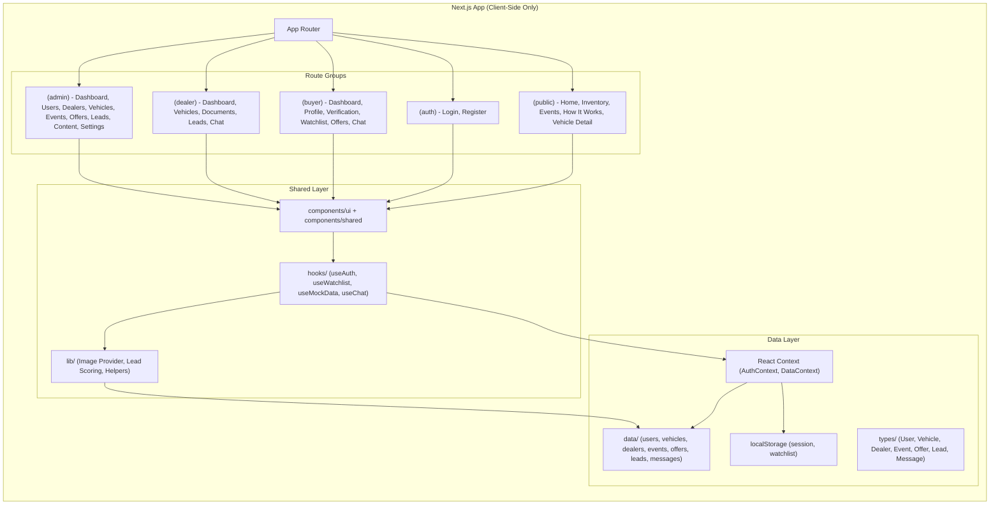
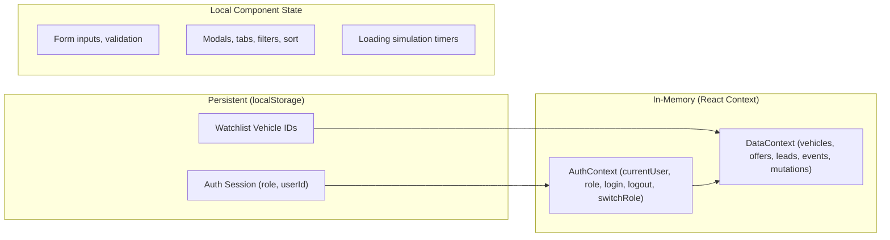

# Design Document: Fair Value MVP

## Overview

Fair Value MVP is a frontend-only navigable prototype for a premium vehicle offers/auction platform built with Next.js (App Router), TypeScript, React, and Tailwind CSS. The platform acts as an intermediary between buyers and verified dealerships, facilitating leads and connections through timed offer events — without processing real transactions, authentication, or backend services.

The architecture prioritizes:
- **Demo-readiness**: Every route is reachable, every action produces visible feedback
- **Maintainability**: Centralized mock data, reusable components, strict typing
- **Premium aesthetics**: Luxury design system with consistent tokens and smooth transitions
- **Three-perspective navigation**: Buyer, Dealer, and Admin each have dedicated dashboards and workflows

### Key Design Decisions

1. **Route Groups for Role Isolation**: Next.js App Router route groups `(public)`, `(auth)`, `(buyer)`, `(dealer)`, `(admin)` cleanly segment navigation and layout concerns without nesting.
2. **Mock Data as Source of Truth**: All entities live in `/src/data/` as typed TypeScript arrays. State mutations happen in-memory via React context/state. No API layer exists.
3. **Simulated Auth via Context + localStorage**: A global AuthContext provides role-switching, persisted minimally in localStorage for session continuity.
4. **Centralized Image Provider**: A single utility resolves image URLs by entity type and ID, ensuring no hardcoded URLs in components.
5. **Lead Scoring as Pure Function**: `calculateLeadScore` is implemented as a deterministic pure function, enabling isolated testing and configurable weights.

## Architecture

### High-Level Architecture



### State Management Strategy



### Navigation Flow

| Role | Layout | Navigation Style | Key Routes |
|------|--------|-----------------|------------|
| Public/Visitor | Top navbar + footer | Horizontal nav links | /, /inventory, /events, /how-it-works, /vehicle/[id] |
| Auth | Minimal centered layout | Back link only | /login, /register |
| Buyer | Top navbar + breadcrumbs | Horizontal nav with dropdown | /buyer/dashboard, /buyer/profile, /buyer/verification, /buyer/watchlist, /buyer/offers, /buyer/chat |
| Dealer | Top navbar + breadcrumbs | Horizontal nav with dropdown | /dealer/dashboard, /dealer/vehicles, /dealer/documents, /dealer/leads, /dealer/chat |
| Admin | Sidebar + top bar | Vertical sidebar navigation | /admin/dashboard, /admin/users, /admin/dealers, /admin/vehicles, /admin/events, /admin/offers, /admin/leads, /admin/content, /admin/settings |

## Components and Interfaces

### Design System Primitives (`components/ui/`)

| Component | Variants | Props |
|-----------|----------|-------|
| Button | primary, secondary, outline, ghost | variant, size, disabled, loading, icon, onClick |
| Input | text, email, password, number, tel | type, label, placeholder, error, maxLength, onChange |
| Select | single | options, label, placeholder, value, onChange |
| Card | default, elevated, outlined | padding, className, onClick, children |
| Badge | status, level, count | variant, color, label |
| Modal | default, confirmation | open, onClose, title, children, actions |
| Tabs | default | tabs[], activeTab, onChange |
| Table | default | columns[], data[], pagination, sortable |
| Avatar | image, initials | src, name, size |
| Skeleton | text, card, table-row, image | variant, width, height, count |
| Tooltip | default | content, position, children |
| ProgressBar | default, scored | value, max, color, label |

### Domain Components (`components/shared/`)

| Component | Purpose | Key Props |
|-----------|---------|-----------|
| VehicleCard | Displays vehicle summary in grid contexts | vehicle, onFavorite, isFavorited, showStatus |
| Gallery | Image carousel with navigation | images[], fallbackImage |
| HeroSection | Landing page hero with search | onSearch |
| EventCard | Event summary with countdown | event, showCountdown |
| LeadRow | Lead table row with actions | lead, isLocked, onSelect, onUnlock |
| ChatThread | Message thread with input | messages[], onSend, isLocked |
| Navigation | Role-adaptive top/sidebar nav | role, currentPath |
| FilterPanel | Composable filter controls | filters[], values, onChange, onClear |
| CountdownTimer | Live countdown display | targetDate |
| StepIndicator | Status progression visualization | steps[], currentStep |
| PrivacyNotice | Data protection disclosure | context ("offer" | "lead" | "vehicle") |
| EmptyState | No-data placeholder | title, message, action |
| SkeletonPage | Page-level loading placeholder | variant ("grid" | "table" | "detail") |

### Key Custom Hooks (`hooks/`)

```typescript
// useAuth - Authentication simulation
useAuth(): {
  user: User | null;
  role: UserRole;
  isAuthenticated: boolean;
  login: (email: string, password: string) => void;
  logout: () => void;
  switchRole: (role: UserRole) => void;
  register: (data: RegisterData) => void;
}

// useWatchlist - Favorites with localStorage persistence
useWatchlist(): {
  watchlist: string[]; // vehicle IDs
  isFavorited: (vehicleId: string) => boolean;
  toggleFavorite: (vehicleId: string) => void;
}

// useMockData - Central data access with mutations
useMockData(): {
  vehicles: Vehicle[];
  offers: Offer[];
  leads: Lead[];
  events: Event[];
  dealers: Dealer[];
  users: User[];
  addOffer: (offer: NewOffer) => void;
  updateLeadStatus: (leadId: string, status: LeadStatus) => void;
  updateEventStatus: (eventId: string, status: EventStatus) => void;
  // ... additional mutations
}

// useChat - Mock messaging
useChat(threadId: string): {
  messages: Message[];
  sendMessage: (text: string) => void;
  isLocked: boolean;
}

// useFilters - Reusable filter/sort/search logic
useFilters<T>(items: T[], config: FilterConfig): {
  filtered: T[];
  filters: FilterState;
  setFilter: (key: string, value: any) => void;
  setSearch: (query: string) => void;
  setSort: (field: string, direction: 'asc' | 'desc') => void;
  clearAll: () => void;
  activeCount: number;
}
```

## Data Models

### Core TypeScript Interfaces

```typescript
// types/user.ts
interface User {
  id: string;
  name: string;
  email: string;
  phone: string;
  role: 'buyer' | 'dealer' | 'admin';
  registrationDate: string; // ISO 8601
  isActive: boolean;
  profilePhoto?: string;
  verificationStatus: 'not_started' | 'documents_uploaded' | 'under_review' | 'verified' | 'rejected';
  emailVerified: boolean;
  phoneVerified: boolean;
  // Buyer-specific
  budgetRange?: { min: number; max: number };
  preferredLocation?: string;
  vehiclePreferences?: {
    preferredType?: string;
    yearRange?: { min: number; max: number };
    preferredMake?: string;
  };
  profileCompleteness: number; // 0-100
}

// types/vehicle.ts
interface Vehicle {
  id: string;
  dealerId: string;
  make: string;
  model: string;
  year: number;
  mileage: number;
  fuelType: 'gasoline' | 'diesel' | 'electric' | 'hybrid';
  transmission: 'automatic' | 'manual';
  engine: string;
  color: string;
  vin: string;
  bodyType: 'sedan' | 'suv' | 'truck' | 'coupe' | 'hatchback' | 'convertible' | 'van';
  price: number;
  description: string;
  status: 'draft' | 'pending_approval' | 'active' | 'assigned_to_event' | 'closed' | 'rejected';
  imageIds: string[]; // resolved via Image Provider
  views: number;
  submissionDate: string; // ISO 8601
  eventId?: string;
}

// types/dealer.ts
interface Dealer {
  id: string;
  userId: string;
  businessName: string;
  contactEmail: string;
  contactPhone: string;
  businessAddress: string;
  registrationDate: string; // ISO 8601
  approvalStatus: 'pending_approval' | 'approved' | 'suspended' | 'rejected';
  vehicleCount: number;
  leadCount: number;
}

// types/event.ts
interface Event {
  id: string;
  name: string;
  description: string;
  startDate: string; // ISO 8601
  endDate: string; // ISO 8601
  status: 'scheduled' | 'active' | 'closed' | 'in_review' | 'finished';
  vehicleIds: string[];
  offerCount: number;
}

// types/offer.ts
interface Offer {
  id: string;
  buyerId: string;
  vehicleId: string;
  eventId: string;
  amount: number;
  submissionDate: string; // ISO 8601
  status: 'received' | 'surpassed' | 'in_review' | 'selected' | 'not_selected';
}

// types/lead.ts
interface Lead {
  id: string;
  buyerId: string;
  vehicleId: string;
  dealerId: string;
  eventId: string;
  offerId: string;
  score: number; // 0-100
  level: 'Cold' | 'Medium' | 'Hot' | 'Priority';
  reasons: string[];
  status: 'generated' | 'released' | 'selected' | 'contacted' | 'appointment_scheduled' | 'not_interested' | 'closed_externally';
  releaseStatus: 'unreleased' | 'released';
  isUnlocked: boolean;
  offerAmount: number;
}

// types/message.ts
interface Message {
  id: string;
  threadId: string;
  senderId: string;
  senderName: string;
  text: string;
  timestamp: string; // ISO 8601
}

// types/scoring.ts
interface ScoringWeights {
  offerAmount: number; // 0-100, default 40
  verification: number; // 0-100, default 25
  profileCompleteness: number; // 0-100, default 20
  timing: number; // 0-100, default 15
}

interface LeadScoreResult {
  score: number; // 0-100
  level: 'Cold' | 'Medium' | 'Hot' | 'Priority';
  reasons: string[];
}

interface ScoringInput {
  profile: {
    verificationStatus: string;
    emailVerified: boolean;
    phoneVerified: boolean;
    profileCompleteness: number;
    budgetRange?: { min: number; max: number };
    documentCount: number;
  };
  offers: Array<{
    amount: number;
    timestamp: string;
    vehiclePrice: number;
    eventStartDate: string;
    eventEndDate: string;
  }>;
}
```

### Image Provider Interface

```typescript
// lib/imageProvider.ts
type EntityType = 'vehicle' | 'user' | 'dealer' | 'event';

interface ImageProvider {
  getImageUrl(entityType: EntityType, entityId: string, index?: number): string;
  getImageUrls(entityType: EntityType, entityId: string): string[];
  getFallbackUrl(entityType: EntityType): string;
}
```

### Lead Scoring Function Interface

```typescript
// lib/leadScoring.ts
function calculateLeadScore(
  input: ScoringInput,
  weights?: ScoringWeights
): LeadScoreResult;

function getLeadLevel(score: number): 'Cold' | 'Medium' | 'Hot' | 'Priority';

function calculateOfferAmountSubScore(
  offerAmount: number,
  vehiclePrice: number
): number; // 0-100

function calculateVerificationSubScore(
  emailVerified: boolean,
  phoneVerified: boolean
): number; // 0-100

function calculateProfileSubScore(
  completeness: number
): number; // 0-100

function calculateTimingSubScore(
  offerTimestamp: string,
  eventStartDate: string,
  eventEndDate: string
): number; // 0-100
```


## Correctness Properties

*A property is a characteristic or behavior that should hold true across all valid executions of a system — essentially, a formal statement about what the system should do. Properties serve as the bridge between human-readable specifications and machine-verifiable correctness guarantees.*

### Property 1: Pagination invariant

*For any* array of vehicles with length N and a page size of 24, the paginated result for page P should contain exactly `min(24, N - (P-1)*24)` items when P is a valid page number, and pagination should produce no duplicate or missing vehicles across all pages.

**Validates: Requirements 4.1**

### Property 2: Vehicle filter correctness

*For any* set of vehicles and any combination of filter values (make, model, year range, price range, mileage range, fuel type, transmission, body type, location), every vehicle in the filtered result satisfies ALL active filter criteria, and no vehicle satisfying all criteria is excluded from the result.

**Validates: Requirements 4.2**

### Property 3: Case-insensitive search matching

*For any* set of vehicles and any search query of 2+ characters, every vehicle in the search result contains the query as a case-insensitive substring of its make, model, or description, and no vehicle containing the match is excluded.

**Validates: Requirements 4.3**

### Property 4: Sort ordering invariant

*For any* set of vehicles and any selected sort option (price low-high, price high-low, year newest, year oldest, date added), the resulting array is correctly ordered such that for every consecutive pair (a, b), `a[sortField]` compares correctly to `b[sortField]` according to the sort direction.

**Validates: Requirements 4.4**

### Property 5: Active filter count accuracy

*For any* set of applied filters, the displayed active filter count equals the number of filter fields that have a non-default (non-empty) value.

**Validates: Requirements 4.8**

### Property 6: VehicleCard renders all required fields

*For any* valid Vehicle object, rendering a VehicleCard component produces output containing the vehicle's image, title formatted as "[year] [make] [model]", price, status badge, mileage, fuel type, and transmission.

**Validates: Requirements 4.7**

### Property 7: Role-based authentication redirect

*For any* valid user with a role of 'buyer', 'dealer', or 'admin', successful login redirects to the corresponding dashboard path: '/buyer/dashboard', '/dealer/dashboard', or '/admin/dashboard' respectively.

**Validates: Requirements 8.4**

### Property 8: File upload validation

*For any* file metadata with a size and type, the validation function rejects files exceeding the size limit (5MB for buyer verification, 10MB for dealer documents) or with types not in the accepted list (JPEG, PNG, PDF), and accepts all files within constraints.

**Validates: Requirements 10.9, 16.4**

### Property 9: Watchlist toggle idempotence

*For any* vehicle ID, toggling the favorite twice returns the watchlist to its original state (add then remove = no change), and toggling once changes the favorited status to its complement.

**Validates: Requirements 11.2, 11.3**

### Property 10: Offer amount validation

*For any* numeric value, the offer validation function accepts values between 0.01 and 999,999,999.99 (inclusive) with up to 2 decimal places, and rejects values outside this range, non-numeric inputs, or values with more than 2 decimal places.

**Validates: Requirements 12.2**

### Property 11: Chat message whitespace rejection

*For any* string composed entirely of whitespace characters (including empty string), the chat send function rejects it and does not append to the message thread. For any non-empty, non-whitespace-only string up to 500 characters, the message is accepted and appended.

**Validates: Requirements 13.6**

### Property 12: Lead score level assignment

*For any* numeric score from 0 to 100, the getLeadLevel function returns 'Cold' for scores 0-39, 'Medium' for 40-59, 'Hot' for 60-79, and 'Priority' for 80-100.

**Validates: Requirements 17.4, 28.3**

### Property 13: Lead ranking order

*For any* set of leads, sorting by Lead_Score descending with offer amount descending as tiebreaker produces a result where for every consecutive pair (a, b): either a.score > b.score, or (a.score === b.score AND a.offerAmount >= b.offerAmount).

**Validates: Requirements 17.3**

### Property 14: User filter AND logic

*For any* set of users and any combination of role, verification status, and active status filters, every user in the filtered result satisfies ALL active filter conditions simultaneously.

**Validates: Requirements 20.2**

### Property 15: Event status transition validity

*For any* Event with a given status, only the next valid status in the sequence (scheduled → active → closed → in_review → finished) is an allowed transition. All other transitions are rejected.

**Validates: Requirements 24.6**

### Property 16: Scoring weights validation

*For any* tuple of four integer weights (offerAmount, verification, profileCompleteness, timing), the validation function accepts the weights if and only if they all fall between 0 and 100 inclusive AND their sum equals exactly 100.

**Validates: Requirements 27.3, 27.4**

### Property 17: Lead score calculation correctness

*For any* valid ScoringInput (profile with verification status, completeness, budget; offers with amounts, timestamps, event dates) and valid ScoringWeights summing to 100, the calculateLeadScore function returns a score equal to the weighted sum of sub-scores (each 0-100), clamped to the 0-100 range, with a level matching the score per the level ranges.

**Validates: Requirements 28.1, 28.2**

### Property 18: Scoring reasons correspond to profile state

*For any* buyer profile, the reasons array in the LeadScoreResult contains "verified email" if and only if emailVerified is true, "verified phone" if and only if phoneVerified is true, "complete profile" if and only if profileCompleteness equals 100, "budget matches listing" if and only if the vehicle price falls within the buyer's budget range, and "early offer" if and only if the offer was placed in the first 50% of event duration.

**Validates: Requirements 28.4**

### Property 19: Privacy anonymization invariant

*For any* event with status 'active' or 'upcoming', and for any buyer or dealer associated with that event, personal identity information (name, email, phone) is never exposed in the UI — buyers see "Verified Dealer" and dealers/public see "Buyer #N". This holds for closed events where leads have not been selected.

**Validates: Requirements 29.1, 29.2, 29.8**

### Property 20: Privacy unlock reveals data

*For any* lead that transitions to 'selected' (unlocked) status, the buyer's full name, email, and phone become visible to the dealer, AND the dealer's business name, phone, and email become visible to the buyer.

**Validates: Requirements 29.3, 29.4, 29.5**

### Property 21: Image Provider fallback

*For any* entity type and entity ID, the Image Provider returns a valid string URL. For any entity ID not present in its mapping, the Image Provider returns the default fallback URL for that entity type (never undefined, null, or empty string).

**Validates: Requirements 30.3, 30.4, 30.5**

## Error Handling

### Form Validation Errors

| Context | Trigger | Behavior |
|---------|---------|----------|
| Login form | Empty email or password | Inline error below field, form not submitted |
| Register form | Missing required field or unchecked terms | Inline error per field, form not submitted |
| Add Vehicle form | Empty/invalid required fields | Highlight invalid fields, show error messages, preserve entered data |
| Create Event form | Invalid dates or empty fields | Inline error indicating specific violation |
| Offer submission | Amount outside 0.01–999,999,999.99 or >2 decimals | Inline error, form stays open, value preserved |
| Content management | Character limit exceeded | Character counter turns red, save disabled |
| Scoring weights | Sum ≠ 100 | Inline error showing current total vs required 100, save disabled |
| File upload | Wrong format or oversized | Error message indicating constraint violated, upload prevented |

### State-Based Error Prevention

| Context | Prevention Strategy |
|---------|-------------------|
| Offer placement on closed event | Disable form, show "offer period ended" message |
| Unverified buyer placing offer | Disable offer button, show verification prompt |
| Chat when lead not selected | Lock icon + disabled input with "awaiting selection" message |
| Event transition to invalid status | Disable non-sequential transition buttons |
| Dealer actions on suspended account | Redirect to status page explaining suspension |

### Empty States

Every data-driven view has a defined empty state:
- **Inventory (no filter results)**: Illustration + "No vehicles found" + "Clear All Filters" button
- **Watchlist (empty)**: Message + link to inventory
- **Offers (none placed)**: Message indicating no offers yet
- **Leads (before event close)**: Locked state with countdown message
- **Leads (no offers received)**: Empty state message
- **Events (none exist)**: "No events currently scheduled" message
- **Users/Dealers (no filter match)**: Suggestion to adjust filters
- **Chat (locked)**: Lock icon + awaiting selection message

### Graceful Mock Failures

When actions that would require real services are triggered (payment, document OCR, AI analysis), the system displays:
- A styled placeholder card/modal acknowledging the action
- A simulated success response with mock data
- No JavaScript errors, console warnings, or broken UI states

## Testing Strategy

### Testing Approach

This project uses a **dual testing strategy**:

1. **Property-Based Tests** — verify universal correctness properties using generated inputs (minimum 100 iterations per property)
2. **Example-Based Unit Tests** — verify specific scenarios, edge cases, and rendering behavior
3. **Integration/Smoke Tests** — verify route accessibility, navigation flow, and component composition

### Property-Based Testing

**Library**: [fast-check](https://github.com/dubzzz/fast-check) (TypeScript-native PBT library for Node.js/Jest)

**Configuration**: Each property test runs a minimum of 100 iterations with random seed logging for reproducibility.

**Tag format**: Each test file includes a comment referencing its design property:
```
// Feature: fair-value-mvp, Property {N}: {property_text}
```

**Properties to implement** (21 total — see Correctness Properties section):
- Properties 1-6: Inventory filtering, pagination, sorting, search, card rendering
- Properties 7-11: Auth redirect, file validation, watchlist toggle, offer validation, chat validation
- Properties 12-16: Lead scoring levels, ranking, user filters, event transitions, weight validation
- Properties 17-18: Lead score calculation, scoring reasons
- Properties 19-21: Privacy anonymization, unlock, image provider

**Key generators needed**:
- `arbitraryVehicle()` — random valid Vehicle objects
- `arbitraryUser()` — random valid User objects with varying roles/verification
- `arbitraryOffer()` — random valid Offer objects
- `arbitraryLead()` — random valid Lead objects with varying scores
- `arbitraryEvent()` — random valid Event objects with varying statuses
- `arbitraryScoringInput()` — random profile + offers for lead scoring
- `arbitraryFilterState()` — random filter combinations
- `arbitraryWeights()` — random weight tuples (both valid and invalid)

### Example-Based Unit Tests

**Library**: Jest + React Testing Library

**Focus areas**:
- Component rendering (all design system primitives render without errors)
- Form validation specific cases (empty fields, boundary values)
- Navigation routing per role
- Empty state rendering
- Skeleton loader timing (300ms–1500ms range)
- Mock auth flow (login, register, role switch)
- Event status badge color mapping
- Responsive breakpoint behavior (using `matchMedia` mocks)

### Integration/Smoke Tests

**Focus areas**:
- All routes in each route group render without errors
- Navigation links resolve to valid routes (no dead ends)
- Role switching updates navigation and accessible routes
- Mock data loads correctly on initial render
- localStorage persistence (watchlist, session) survives page refresh simulation

### Test File Organization

```
/src
├── __tests__/
│   ├── properties/           # Property-based tests
│   │   ├── inventory.property.test.ts
│   │   ├── leadScoring.property.test.ts
│   │   ├── offerValidation.property.test.ts
│   │   ├── privacy.property.test.ts
│   │   ├── eventTransitions.property.test.ts
│   │   ├── watchlist.property.test.ts
│   │   ├── imageProvider.property.test.ts
│   │   └── filters.property.test.ts
│   ├── unit/                 # Example-based unit tests
│   │   ├── components/
│   │   ├── hooks/
│   │   └── lib/
│   └── integration/          # Smoke/integration tests
│       ├── navigation.test.ts
│       └── routes.test.ts
├── __generators__/           # fast-check generators
│   ├── vehicle.generator.ts
│   ├── user.generator.ts
│   ├── offer.generator.ts
│   ├── lead.generator.ts
│   ├── event.generator.ts
│   └── scoring.generator.ts
```
